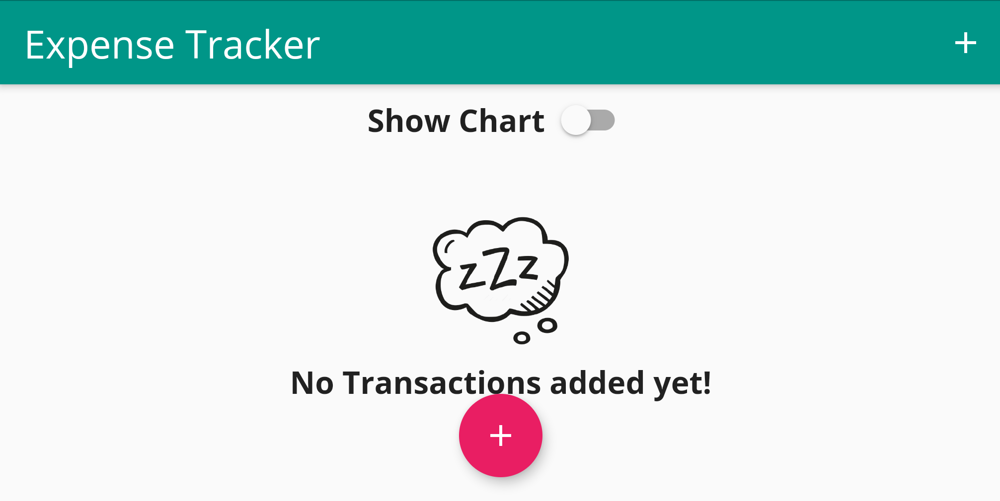
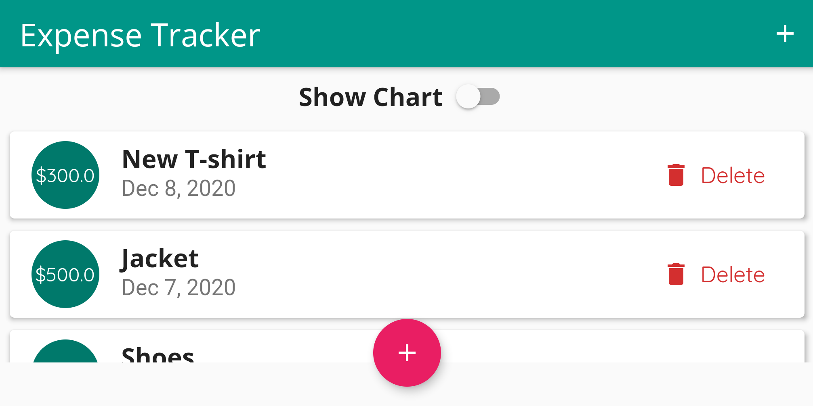
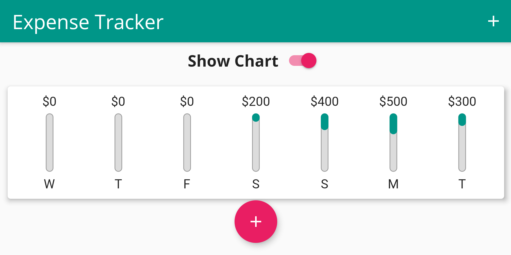

### Personal Expense Tracker Application
An application that can store your small pocket expenses.

### Features
* Weekly Chart bar
* Add your expense tile with title, amount and date
* Delete your expense tile
* Portrait and Landscape mode UI (Responsive UI)
* Works on Android and iOS (Adaptive UI)

### Screen shots
#### Portrait Layout
1. 

2. 

3. 

4. 

5. 

#### Landscape Layout
1. 

2. 

3. 
